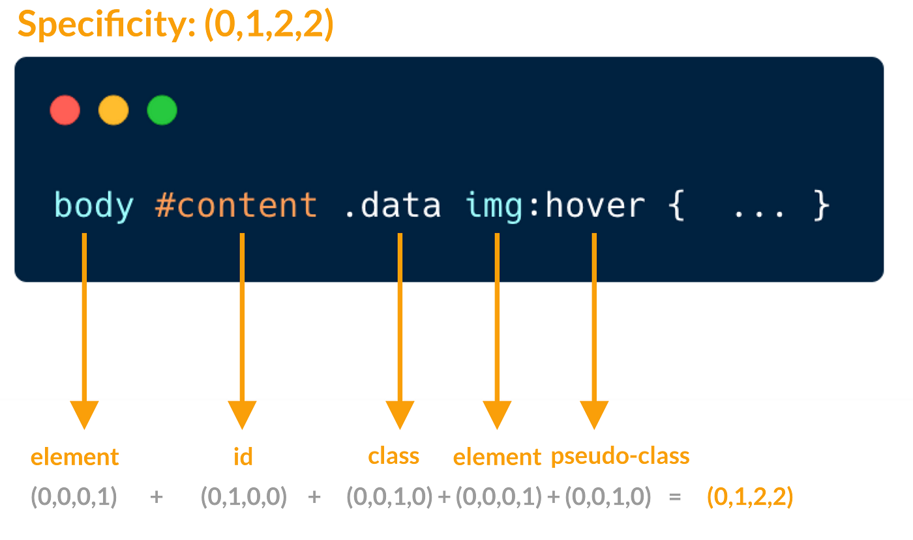
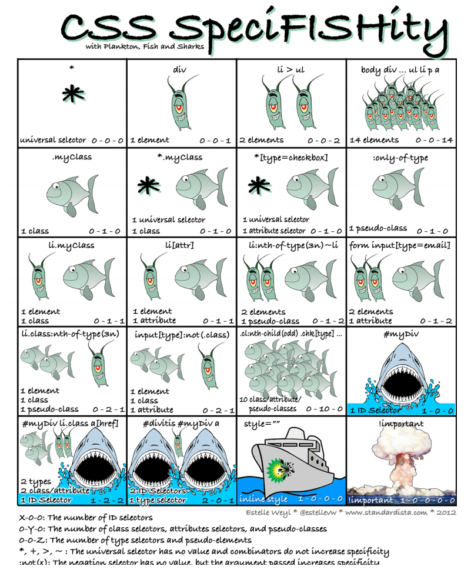
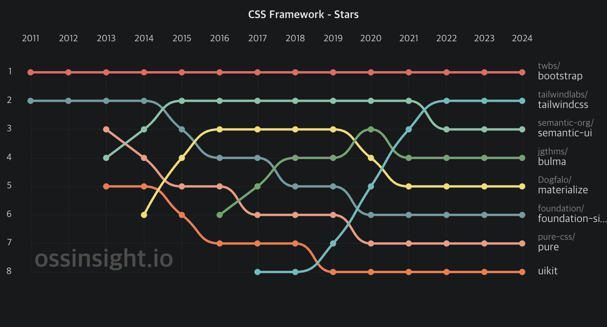

# [우아한타스] 11. CSS-in-JS

## 기존 CSS의 가장 큰 문제점

### 1. Global Scope

- CSS는 global scope를 가지기 때문에 다른 컴포넌트에 영향을 줄 수 있다.
- CSS Module, BEM 등을 사용하여 해결할 수 있지만, 복잡하고 번거롭다.

### 2. Specificity

- CSS의 Specificity가 높아질수록 관리가 어려워진다.
- Specificity가 높아지면서 덮어쓰기가 어려워진다.




## 이로 인한 CSS의 구조적 문제 (p.331)

1. Global Namespace: 모든 스타일이 Global에 선언되어 중복되지 않는 Class명을 사용해야 한다.
2. Dependencies: CSS와 JS 간의 의존관계를 관리하기 어렵다. (현재는 번들러의 발전으로 거의 해결됨)
3. Dead Code Elimination: 기능 추가, 변경, 삭제 시 사용하지 않는 CSS 코드를 제거하기 어렵다.
4. Minification: Class 이름을 최소화하기 어렵다.
5. Sharing Constants: CSS와 JS 간의 상수 공유가 어렵다. (현재는 CSS Variable이 도입됨)
6. Non-deterministic Resolution: CSS의 로드 순서에 따라 스타일 우선순위가 달라진다. (Specificity 문제)
7. Isolation: CSS의 외부 수정을 관리하기 어렵다.

## CSS-in-JS

**JS를 통해 CSS를 만드는** 방식으로 CSS의 구조적 문제를 해결하기 위해 나온 기술

```jsx
import React, { Component } from "react";
import styled from "styled-components";

const Wrapper = styled.div`
  background: black;
`;

const Title = styled.h1`
  color: white;
`;

class App extends Components {
  render() {
    return (
      <Wrapper>
        <Title>Hello, World!</Title>
      </Wrapper>
    );
  }
}
```

### CSS-in-JS의 장점

- CSS-in-JS를 사용하면 Specificity 문제의 원흉인 Selector이 사라짐
- Property와 Value를 컴포넌트 구조에 맞게 작성하면 된다.
- local scope : 컴포넌트 내부에서만 스타일이 적용된다.

### CSS-in-JS의 단점

- 별도의 라이브러리를 사용해야 한다.
- 런타임에 스타일을 생성하기 때문에 CSS-in-CSS보다 성능이 떨어질 수 있다.

## CSS-in-JS with Typescript

리액트 컴포넌트 구현 시 `background-color`, `size`와 같은 값도 props로 받아서 사용할 수 있다.

스타일 관련 props는 styled-components로 전달되는데, **해당 타입을 styled-components에서도 정의**해줘야 함.

→ 타입 중복 선언

```tsx
import styled from "styled-components";

interface Props {
  height?: string;
  color?: keyof typeof colors;
  title: string;
}

export const Title: VFC<Props> = ({ height, color, title }) => {
  // ...
  return (
    <StyledTitle height={height} color={color}>
      {title}
    </StyledTitle>
  );
};

interface StyledProps {
  height?: string;
  color?: keyof typeof colors;
}

const StyledTitle = styled.span<StyledProps>`
  height: ${(props) => props.height || "1px"};
  background-color: ${(props) => colors[props.color || "black"]};
`;
```

`Props`와 `StyledProps`에 중복된 타입을 선언해야 하는 문제가 있다.

### 유틸리티 타입을 사용한 타입 정의

```tsx
const StyledTitle = styled.span<Pick<Props, "height" | "color">>`
  height: ${(props) => props.height || "1px"};
  background-color: ${(props) => colors[props.color || "black"]};
`;
```

또는

```tsx
interface StyledProps extends Pick<Props, "height" | "color"> {}

const StyledTitle = styled.span<StyledProps>`
  height: ${(props) => props.height || "1px"};
  background-color: ${(props) => colors[props.color || "black"]};
`;
```



## Reference

- [역사로 알아보는 CSS가 어려워진 이유: ①웹 문서에서 웹 애플리케이션으로](https://yozm.wishket.com/magazine/detail/1319/)
- [역사로 알아보는 CSS가 어려워진 이유: ②CSS in JS와 Atomic CSS](https://yozm.wishket.com/magazine/detail/1326/)
- [CSS Framework - Ranking](https://ossinsight.io/collections/css-framework/)
