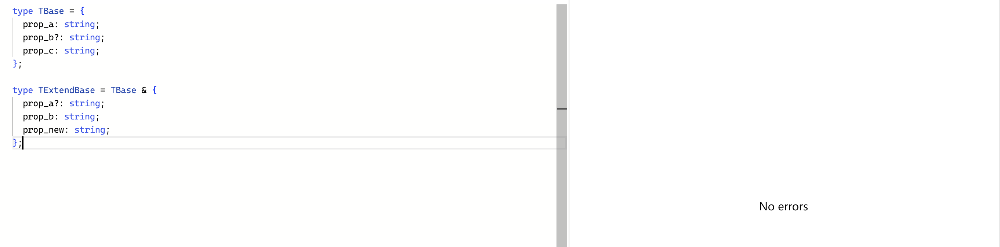

# 타입 확장하기

## Interface와 Type 확장에서의 차이

### interface

```ts
interface IBase {
  prop_a: string;
  prop_b?: string;
  proc_c: string;
}

interface IExtendBase extends IBase {
  prop_a?: string;
  prop_b: string;
  prop_new: string;
}
```


- `prop_a`가 `IExtendBase`의 `prop_a`를 덮어쓰지 못 함
- `IExtendBase`의 `prop_a`는 옵셔널이기 때문에 `IBase`의 `prop_a`보다 더 넓은 범위의 타입을 가진다.

```ts
interface IExtendBase extends IBase {
  prop_a: string | number;
  prop_b: string;
  prop_new: string;
}
```


`IExtendBase`의 `prop_a`가 `string | number`를 갖는데, `IBase`는 `string` 값만 갖기 때문에 에러 발생

만약 `prop_a`의 타입을 변경하고 싶다면 아래와 같이 코드를 작성하면 된다.

```ts
interface IExtendBase extends Omit<IBase, "prop_a"> {
  prop_a?: string;
  prop_b: string;
  prop_new: string;
}
```

- omit을 통해 해결

### type

```ts
type TBase = {
  prop_a: string;
  prop_b?: string;
  prop_c: string;
};

type TExtendBase = TBase & {
  prop_a?: string;
  prop_b: string;
  prop_new: string;
};
```



`type` 키워드를 사용하면 위 코드처럼 작성해도 에러가 나지 않는다.

`type`의 확장은 **두 타입에 포함된 모든 속성을 가진 새 타입**(교집합)을 생성하기 때문이다.

```ts
type TExtendBase = TBase & {
  prop_a: string | number;
  prop_b: string;
  prop_new: string;
};
```


`TExtendBase`의 `prop_a`가 더 넓은 값(`string | number`)의 타입을 가질 경우, `TBase`의 `string` 타입만을 가진다.

→ `string` & `string | number` = `string`

# 타입 가드

## 타입 명제(type predicate)

타입 명제 함수란 `boolean` 값을 반환하고 Return Type으로 `value is type`을 지정해주는 함수

- return 값이 `true`일 경우, 이 스코프에서는 value가 해당 타입이라는 것을 TypeScript가 알 수 있게 된다.

```ts
type Value = string | number;

let value: Value = await fetchSomething();

console.log(value.toUpperCase()); // 에러 발생.. Property 'toUpperCase' does not exist on type 'Value'.
```

**타입 가드를 적용하는 경우**

```ts
//type predicate function
function isString(value: unknown): value is string {
  return typeof value === "string";
}

if (isString(value)) {
  //value의 type은 string으로 narrowing됩니다
  console.log(value.toUpperCase()); // value는 string이기 때문에 toUpperCase()를 호출가능
}
```

- isString 함수가 type predicate이다.

### 예시

**조건**

- data는 `null` 또는 `undefined`가 아니어야 한다.
- data는 숫자여야 한다.
- data는 0이 아니어야 한다.

**타입 가드 함수를 사용하지 않은 경우**

```ts
if (data !== null || data !== undefined) {
  if (typeof data === "number") {
    if (data !== 0) {
      console.log(data);
    }
  }
} else {
  console.log("error");
}
```

**타입 가드 함수를 사용하는 경우**

```ts
const isRequiredAndNumberAndNotZero = (value: any): value is number => {
  return isNumber(value) && isNotZero(value) && isRequired(value);
}

// null 또는 undefined가 아닌지 확인
const isRequired = (value: any): value is any => {
  return value !== null && value !== undefined;
}

// number인지 확인
const isNumber = (value: any): value is number => {
  return typeof value === "number";
}

// 0이 아닌지 확인
const isNotZero = (value: number | string): value is number => {
  return Number(value) !== 0;
}

type StringOrNumber = string | number;

const data: StringOrNumber = await fetchData();

if(isRequiredAndNumberAndNotZero(data){
   console.log(data);
} else {
   console.log("error");
}
```

타입 명제를 이용하면 `typeof`나 `instanceof` 연산자보다 더 유연하게 타입 체크를 할 수 있고, 함수의 이름에서 타입 체크의 의미를 명시하고 있어 가독성을 높일 수 있다.

# 식별할 수 있는 유니온

**리터럴 멤버 속성**이 있는 객체는 그 속성으로 유니온 내의 타입을 구별할 수 있다.

```typescript
interface Square {
  kind: "square";
  size: number;
}

interface Rectangle {
  kind: "rectangle";
  width: number;
  height: number;
}
type Shape = Square | Rectangle;
```

구별 속성(`kind`)에 대해 타입 가드 검사 혹은 `switch`를 사용하면 TypeScript가 특정한 리터럴을 가진 객체임을 알게 된다.

```typescript
function area(s: Shape) {
  if (s.kind === "square") {
    // 이것으로 TypeScript가 `s`가 `Square`임을 알게 됨 ;)
    // 그러므로 `Square`의 멤버를 안전하게 사용할 수 있음 :)
    return s.size * s.size;
  } else {
    // `Square`가 아님? 그러면 TypeScript는
    // 이것이 `Rectangle`일 수 밖에 없음을 알게 됨 ;)
    // 그러므로 `Rectangle`의 멤버를 안전하게 사용할 수 있음 :)
    return s.width * s.height;
  }
}
```

## 타입 추가

만약 Shape 타입에 `Circle` 타입이 추가된다면 개발자 입장에서 처리가 필요한 곳에서 컴파일 에러가 발생하길 바란다.

```ts
interface Square {
  kind: "square";
  size: number;
}

interface Rectangle {
  kind: "rectangle";
  width: number;
  height: number;
}

interface Circle {
  kind: "circle";
  radius: number;
}

type Shape = Square | Rectangle | Circle;
```

Ex. 조치가 필요한 부분:

```ts
function area(s: Shape) {
  if (s.kind === "square") {
    return s.size * s.size;
  } else if (s.kind === "rectangle") {
    return s.width * s.height;
  }
  // 여기서 TypeScript가 오류를 발생시켜주면 얼마나 좋을까?
}
```

## exhaustive 검사 추가

```ts
function area(s: Shape) {
  if (s.kind === "square") {
    return s.size * s.size;
  } else if (s.kind === "rectangle") {
    return s.width * s.height;
  } else {
    // ERROR : `Circle` is not assignable to `never`
    const _exhaustiveCheck: never = s;
  }
}
```

조건에 걸리지 않는 블럭(else)을 하나 추가하고 그 블럭에서 추론된 타입이 `never` 타입과 호환되는 것으로 정의하면 된다.


## `switch` 사용

```ts
function area(s: Shape) {
  switch (s.kind) {
    case "square":
      return s.size * s.size;
    case "rectangle":
      return s.width * s.height;
    case "circle":
      return Math.PI * s.radius * s.radius;
    default:
      const _exhaustiveCheck: never = s;
  }
}
```

# Never

타입을 가능한 값의 집합으로 바라볼 때, `never` 타입은 값의 공집합이다.

집합에 어떤 값도 없기 때문에, `never` 타입은 `any` 타입의 값을 포함해 어떤 값도 가질 수 없다!

## Never 타입은 왜 필요할까?

**불가능**을 나타내야 하는 경우

- 값을 포함할 수 없는 빈 타입
  - 제네릭과 함수에서 허용되지 않는 매개변수
  - 호환되지 않는 타입들의 교차 타입
- 실행이 끝날 때까지 호출자에게 제어를 반환하지 않는 함수의 반환 타입
  - ex) Node의 `process.exit`
  - ex) `while(true) {}`
  - `void`는 호출자에게 함수가 유용한 것을 반환하지 않는다는 의미
- 절대로 도달할 수 없을 else 분기의 조건 타입
- 거부된 프로미스에서 처리된 값으 타입
  ```ts
  const p = Promise.reject("foo"); // const p: Promise<never>
  ```

## Never 타입은 어떻게 쓸까?

### `switch`, `if-else` 문의 모든 상황을 보장한다.

기본 케이스로 이용하면 남아있는 것은 `never` 타입이어야 하기 때문에 모든 상황에 대처하는 것을 보장할 수 있음

```ts
function unknownColor(x: never): never {
  throw new Error("unknown color");
}

type Color = "red" | "green" | "blue";

function getColorName(c: Color): string {
  switch (c) {
    case "red":
      return "is red";
    case "green":
      return "is green";
    default:
      return unknownColor(c); // 'string' 타입은 'never' 타입에 할당할 수 없음
  }
}
```

### 타이핑을 부분적으로 허용하지 않는다.

조건

- `VariantA` 또는 `VariantB` 타입의 매개변수를 받는 함수가 존재
- 사용자는 두 타입의 모든 속성을 포함하는 하위 집합을 전달하면 안 됨

```ts
type VariantA = {
  a: string;
};

type VariantB = {
  b: number;
};

declare function fn(arg: VariantA | VariantB): void;

const input = { a: "foo", b: 123 };
fn(input); // 타입스크립트 컴파일러는 아무런 문제도 지적하지 않지만, 우리의 목적에는 맞지 않는다.
```

- 사용자는 `a` 또는 `b` 속성만 입력해야 한다.

```ts
type VariantA = {
  a: string;
  b?: never;
};

type VariantB = {
  b: number;
  a?: never;
};

declare function fn(arg: VariantA | VariantB): void;

const input = { a: "foo", b: 123 };
fn(input); // ❌ 속성 'a'의 타입은 호환되지 않는다.
```

- `never`을 사용하면 구조적 타이핑을 비활성화하고 사용자가 두 속성을 모두 포함하는 객체를 전달하지 못하도록 막을 수 있다.

### 이론적으로 도달할 수 없는 분기를 표기한다. ⭐️

`infer`를 사용해 조건부 타입 내에 추가 타입 변수를 생성할 경우 모든 `infer` 키워드에 대해 else 분기를 추가해야 한다.

```ts
type A = "foo";

// infer을 통해 A의 타입을 추론하고, 추론한 타입이 "foo"인지 확인한다.
type B = A extends infer C
  ? C extends "foo"
    ? true
    : false // 이 표현식 내에서 'C'는 'A'를 나타낸다.
  : never; // 이 분기는 도달할 수 없지만, 생략도 할 수 없다.

// 직접적으로 A의 타입이 "foo"인지 확인한다.
type B2 = A extends "foo" ? true : false;
```


→ A가 "foo"일 때


→ A가 "foo"가 아닐 때


→ 생략 시 에러

[infer...](https://velog.io/@2ast/TS-infer%EC%97%90-%EB%8C%80%ED%95%B4%EC%84%9C-%EC%A7%A7%EA%B2%8C-%EC%95%8C%EC%95%84%EB%B3%B4%EC%9E%90)
