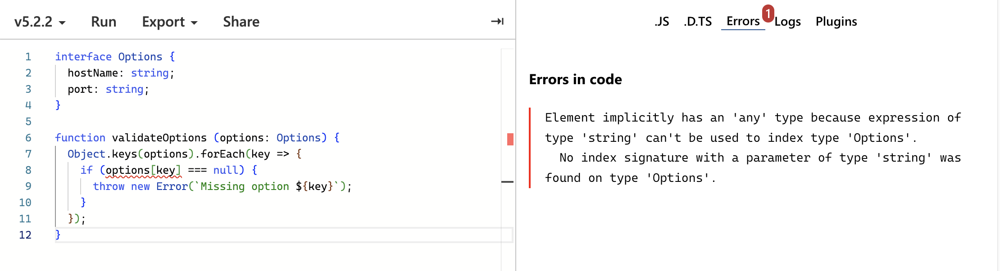
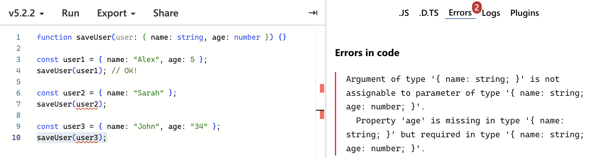
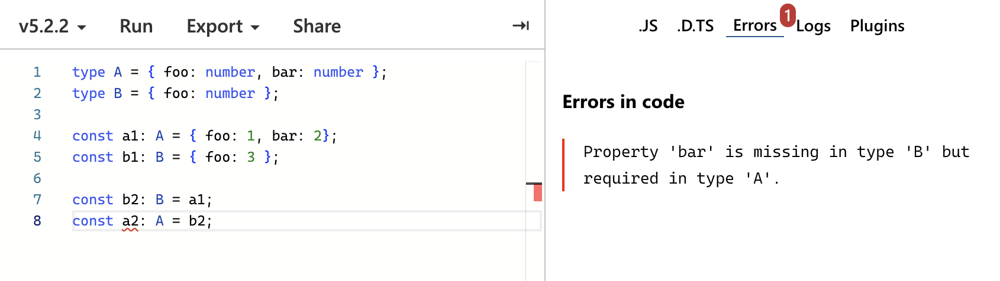
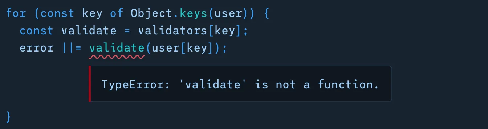
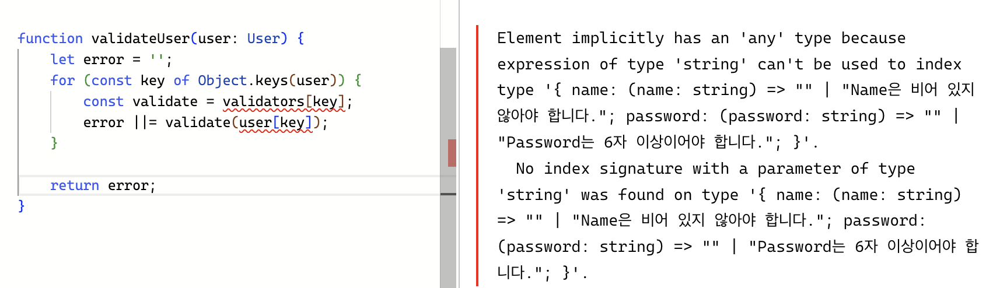

> 원문: [https://alexharri.com/blog/typescript-structural-typing](https://alexharri.com/blog/typescript-structural-typing)

```ts
interface Options {
  hostName: string;
  port: string;
}

function validateOptions(options: Options) {
  Object.keys(options).forEach((key) => {
    if (options[key] === null) {
      throw new Error(`Missing option ${key}`);
    }
  });
}
```



`Object.keys`를 사용하여 `options`에 접근하려고 하지만, 타입스크립트는 이를 자동으로 알아채지 못한다.

### 우회

이 문제를 우회하기 위해선 `keyof typeof` 키워드를 사용하면 된다.

```ts
const keys = Object.keys(options) as (keyof typeof options)[];

keys.forEach((key) => {
  if (options[key] === null) {
    throw new Error(`Missing option ${key}`);
  }
});
```

그런데 애초에 왜 타입스크립트에서는 Object.keys의 타입을 적절하게 추론하지 못할까?

## `Object.keys`의 타입 정의

`Object.keys`의 타입 정의는 다음과 같다.

```ts
// typescript/lib/lib.es5.d.ts

interface Object {
  keys(o: object): string[];
}
```

- **매개변수** : `object`
- **반환값** : `string[]`

### 제네릭 매개변수 사용

```ts
interface Object {
  keys<T extends object>(o: T): (keyof T)[];
}
```

`Object.keys`가 제네릭 매개변수 `T`를 받아 `(keyof T)[]`를 반환하도록 만든다면 타입 에러는 발생하지 않았을 것이다.

하지만 타입스크립트에서 `Object.keys`를 이렇게 정의하지 않은 이유가 존재한다. 그 이유는 타입스크립트의 **구조적 타입 시스템**과 관련이 있다.

## 타입스크립트의 구조적 타이핑

타입스크립트는 property가 누락 되었거나 잘못된 타입일 때 에러를 표시한다



그러나 **추가 프로퍼티가 포함되어 있을 때**는 에러를 표시하지 않는다!

```ts
function saveUser(user: { name: string; age: number }) {}

const user = { name: "Alex", age: 25, city: "Reykjavik" };
saveUser(user); // OK!
```

이는 구조적 타입 시스템 때문이다.

- 타입 `A`가 `B`의 모든 프로퍼티를 포함(슈퍼셋)하는 경우 타입 `A`를 `B`에 할당할 수 있다.



---

> `T` 타입의 객체가 있을 때, 해당 객체에 대해 하는 것은 `T`의 프로퍼티를 적어도 하나 포함하고 있다는 것뿐이다.
>
> 정확히 `T`에 대한 프로퍼티만 가지고 있는지 여부는 **알 수 없다**!

## `Object.keys`의 안전하지 않은 사용

`User` 인터페이스

```ts
interface User {
  name: string;
  password: string;
}
```

`User`의 각 프로퍼티에 대한 유효성 검사 함수가 포함된 `validators` 객체

- `name`은 비어 있지 않아야 한다
- `password`는 6자 이상이어야 한다

```ts
const validators = {
  name: (name: string) => (name.length < 1 ? "Name must not be empty" : ""),
  password: (password: string) =>
    password.length < 6 ? "Password must be at least 6 characters" : "",
};
```

유효성 검사기를 통해 `User` 객체를 실행하는 `validateUser` 함수

```ts
function validateUser(user: User) {
  // 유효성 검사기를 통해 User 객체 전달
}
```

`user`에 있는 각 프로퍼티의 유효성 검사를 위해 `Object.keys`를 사용할 수 있다.

```ts
function validateUser(user: User) {
  let error = "";

  for (const key of Object.keys(user)) {
    const validate = validators[key];
    error ||= validate(user[key]);
  }

  return error;
}
```

> 타입 에러는 잠시 무시,,

이 접근 방식의 문제점은 `user` 객체에 `validators`에 존재하지 않는 프로퍼티가 포함될 수 있다는 것이다.

```ts
interface User {
  name: string;
  password: string;
}

function validateUser(user: User) {}

const user = {
  name: "Alex",
  password: "1234",
  email: "alex@example.com",
};

validateUser(user); // OK!
```

`User`가 `email` 프로퍼티를 지정하지 않더라도 구조적 타이핑을 통해 불필요한 프로퍼티를 제공할 수 있다.

런타임에 `email` 프로퍼티로 인해 `validate`가 `undefined`가 될 것이고 호출될 때 오류를 발생하게 된다.



타입스크립트에서는 다행히도 코드가 실행되기 전에 타입 에러를 발생시킨다.



`Object.keys`가 현재의 타입으로 정의된 이유는 객체에 타입 시스템이 인식하지 못하는 프로퍼티가 포함될 수 있기 때문이다.
