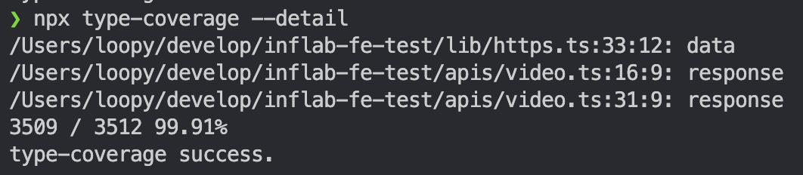

# 12장 타입스크립트 프로젝트 관리 관리

## 앰비언트 타입 활용하기

`.d.ts`를 활용하는 타입이다.

보통 배포할 때 .js파일과 .d.ts파일을 나누어서 하는데 그 이유는 빠른 컴파일 타입을 주기 위함이다.

→ `tsconfig.json`파일의 `declaration`을 true로 설정하면 자동으로 `.d.ts`파일을 생성한다.

### 주의점

타입스크립트 프로젝트라면 앰비언트 타입 선언을 사용할 이유가 없다.

코드의 의존성 관계가 명확하지 않아 나중에 변경할 때 어려움을 겪을 수 있다.

### 잘못하면 생기는 문제점

declare을 선언하여 하면 타입의 의존성에 대한 관계가 보이지 않기 때문에 변경에 의한 영향 범위를 파악하기 어려울 것이다.

그래서 타입 선언 위치가 명확해야 가독성이 높아지고 유지보수 하기도 편할 것이다.

### 활용하기

`.d.ts`는 안에 전역 변수와 같은 역활을 한다.

declare type으로 선언하여 사용하기도 한다.

```tsx
declare type Nullable<T> = T | null;
```

styled-components의 경우에는 당므과 같이 선언되기도 한다.

```tsx
declare module "styled-components" {
  type Theme = typeof theme;

  export interface DefaultTheme extends Theme {}
}
```

declare namespace로 .env같은 파일을에 타입을 넣을 수 있다.

```tsx
declare namespace NodeJS {
  interface ProcessEnv {
    readonly API_URL: string;
    // ...
  }
}
```

심지어 우리가 쓰는 코드에는 없지만 번들러를 통한 주입으로 만들 수 있는 기염도 있다.

```tsx
const color = {
  white: "#ffffff",
  black: "#000000",
} as const;

type ColorSet = typeof color;

declare global {
  const _color: ColorSet;
}

// rollup.config.js
import inject from '@rollup/plugin-injext';
import typescript from '@rollup/plugin-typescript';

export default [
  {
    import :'index.ts',
    output: [
      {
        dir: 'lib',
        format: 'esm',
      },
    ],
    plugins: [typescript(), inject({ _color: ["./data", "color"] })],
  },
];
```

## 스크립트 설정 파일 활용하기

개발하다보면 분명 타입 에러를 체크하는게 느려진다. 그래서 다음과 같은 도구를 이용하면 좋다.

```bash
yarn tsc --noEmit --incremental -w
```

—noEmit: 출력 파일 생성하지 않는다.

—incremental: 증분 컴파일을 활성화

-w: 파일 변경 사항을 모니터링 한다.

### 타입 커버리지 확인하기

```bash
npx type-coverage --detail
```



### 타입스크립트 컴파일 속도 높이기

incremental를 통해 증분 컴파일로 속도를 빠르게 만들면 된다.

## 타입스크립트 마이그레이션

1. 마이그레이션을 할지 다시 개발 할지 고민해봐야 한다.
2. 마이그레이션을 하더라도 작은 부분부터 시작해야한다.

## 모노레포

여러 프로젝트에서 utils의 경우에서도 통합할 수 있는 부분이 있을 것이다. 이를 공통적인 부분으로 통합하는 것도 좋다.

작은 프로젝트에서도 번들러, 테스트 Linkt, CI/CD 스크립트, 도커 등 다양한 설정을 하게 된다. 그러기 때문에 모노레포로 하면 불필요한 설정을 하나로 몰아서 할 수 있다.

하지만 단점으로 레포지토리가 커질 수 있으며 여러 팀의 이해관계에 얽혀 있다면 소유권과 권한 관리가 복잡해질 수 있다. 그래서 이를 사전에 명확하게 정하고 규칙을 설정해야한다.
