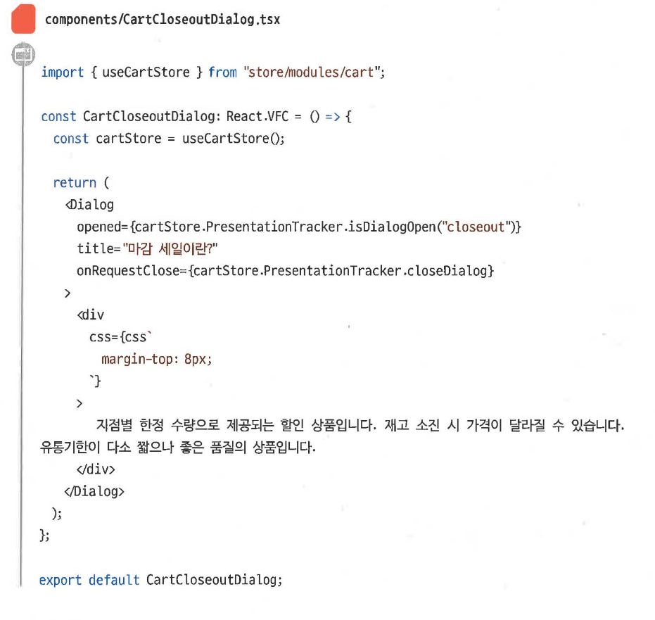

# 타입스크립트와 객체 지향

## 타입스크립트의 객체지향

타입스크립트는 다음 세 가지 언어가 결합한 형태

- 점진적 타이핑
  - 개발자가 명시한 부분만 정적 타입검사를 거치게하고 나머지 부분은 그대로 **동적 타입 검사**가 이루어지도록 하여 점진적 개선을 하도록 함.
- 덕 타이핑
  - 객체의 변수와 메서드 집합이 객체의 타입을 결정하게 함.
- 구조적 타이핑
  - 객체의 속성에 해당하는 특정 타입의 속성을 갖는지를 검사함.

### 의존성 주입

우리는 리액트나 뷰를 사용하며 의존성 주입을 사용하고 있다.

의존성 주입을 구현하기위해서는 A클래스가 B클래스가 의존하더라도, A가 B의 구체클래스가 아닌 인터페이스에 의존하도록 설계해야 한다.

이를 통해 객체 간의 결합도를 낮출 수 있다.

### 컴포넌트

웹 개발에서 객체지향이 어려운 이유가 있다.

JSX와 같은 선언식 문법을 자주 사용하기 때문이다.

컴포넌트 간의 협력관계를 미리 고려하고 설계하는 것이 어렵다.

→ 사전에 레이아웃이나 디자인의 변화를 예측할 수 없기 때문이다.

## 우아한 형제들의 활용 방식

프론트엔드의 특성상, 레이아웃이 변경될 가능성이 높은 이유로 객체지향을 잘 활용하기 어렵다.

그렇다면 우형에서는 어떻게 객체지향을 활용할까?

- 온전히 레이아웃만 담당하는 **컴포넌트 영역**
- 컴포넌트 영역 위에서 레이아웃과 비즈니스 로직을 연결해주는 **커스텀 훅 영역**
- 훅 영역 위에서 객체로서 상호 협력하는 **모델 영역**
- 모델 영역 위에서 API를 해석하여 모델로 전달하는 **API 레이어 영역**

- 해당 컴포넌트는 레이아웃만 담당하고
- 비즈니스 로직은 useCartStore에서 끌어올 것이다.

### 함수형 컴포넌트 vs 클래스 컴포넌트

- 리액트 훅이 나온 이후부터는 리액트에서 함수형 컴포넌트를 권장하고 있다.
- 하지만 클래스 컴포넌트를 사용하면 여러개의 일관된 템플릿을 쉽게 만들 수 있다.
- 하지만 상속 구조가 복잡해지면 코드 해석이 어려워지고, 디버깅도 힘들어진다.
- 프로젝트에 어떤 방식이 적합한지를 심도 있게 고민하자..!

## 캡슐화와 추상화

캡슐화는 객체 지향에서 끊임없이 나오는 핵심 개념 중 하나이다.

- 추상화
  - 객체들을 모델링하는 과정
  - 사람이 인지할 수 있도록 적합한 설계를 하는 것
- 캡슐화
  - 다른 객체 내부의 데이터를 꺼내와서 직접 다루지 않고, 해당 객체에게 처리할 행위를 따로 요청하는 것
  - 컴포넌트의 내부 데이터인 state가 캡슐화의 대상이될 수 있다.
