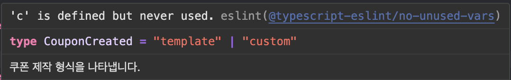
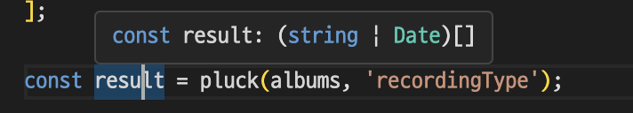
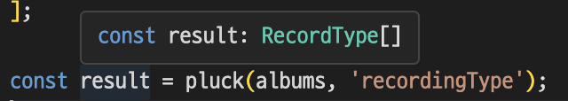

# string 타입보다 더 구체적인 타입 사용하기

string의 타입은 매우 넓다. (매우 넓은 건 자명하다)

string 타입으로 변수를 선언하려면, 혹시 그보다 더 좁은 타입이 적절한 타입은 아닌지 고민해보아야 한다.

앨범 타입을 만든다고 가정해보자.

```ts
interface Album {
  artist: string;
  title: string;
  releaseDate: string; // YYYY-MM-DD 형식이어야 함.
  recordingType: string; // live 혹은 studio
}
```

스트링 타입이 남발된 모습이다. 또한 주석에 타입 정보를 적어둔 것을 보면, 타입스크립트가 제 기능을 하지 못하고 있다고 보인다.

실제로 변수에 이상한 값이 들어가도 타입스크립트는 전혀 에러를 캐치하지 못한다.

```ts
const album: Album = {
  artist: 'New Jeans',
  title: 'ETA',
  releaseDate: '2023년 08월 언저리',
  recordingType: 'Digital Mix',
};
```

타입의 범위를 좁혀나가보자.

먼저 artist나 title 같은 경우는 좁히기가 힘들다. 노래가수나 노래제목은 따로 제한이 있는 것이 아니기 때문이다.

그러나 releaseDate 프로퍼티는 특정한 속성을 가지고 있다. 이 때 템플릿 리터럴 타입을 활용할 수 있다.

```ts
type OneToNine = 1 | 2 | 3 | 4 | 5 | 6 | 7 | 8 | 9;
type ZeroToNine = 0 | 1 | 2 | 3 | 4 | 5 | 6 | 7 | 8 | 9;
type Century = 19 | 20;

type ReleaseYear = `${Century}${ZeroToNine}${ZeroToNine}`;
type ReleaseMonth = `0${OneToNine}` | 10 | 11 | 12;
type ReleaseDay =
  | `0${OneToNine}`
  | `1${ZeroToNine}`
  | `2${ZeroToNine}`
  | 30
  | 31;

type ReleaseDate = `${ReleaseYear}-${ReleaseMonth}-${ReleaseDay}`;
```

이러면 타입을 엄격하게 좁힐 수 있지만, 코드가 복잡하기도 하고 타입스크립트 컴파일 시간이 늘어날 수도 있다. (템플릿 리터럴 타입 참조)

명세를 살짝 변경해 `Date`` 타입을 사용하는 것이 좋아보인다.

recordingType 같은 경우에는 'live' 와 'studio' 두개의 타입이 있는데, 유니온으로 묶어주는게 좋아보인다.

최종적인 개선 타입은 다음과 같다.

```ts
type RecordType = 'live' | 'studio';
interface Album {
  artist: string;
  title: string;
  releaseDate: Date;
  recordingType: RecordType;
}
```

이렇게 타입을 좁혀놓으면 몇가지 장점이 있다.

1. 타입을 명시적으로 정의함으로 다른 곳에서 값을 사용하더라도 타입 정보가 유지된다.

예를 들어 녹음타입에 따른 곡을 찾는 함수를 만든다고 하자. 그러면 매개변수로 string대신 recordType을 받으므로 타입정보를 의미있게 사용가능하다.

```ts
function findAlbumsByType(recordType: RecordType) {
  // ...
}
```

2. 타입을 명시적으로 사용하고 사용처에서 해당 타입의 의미를 설명하는 주석을 넣을 수 있다.

나는 많이 사용하지 않는 기능이지만, 사용처에서 어떤 타입인지 설명하는 주석을 볼 수 있다. 앞서 본 예시와 같이 타입을 명시해주면.. =

```ts
/** 쿠폰 제작 형식을 나타냅니다. */
export type CouponCreated = 'template' | 'custom';
```

사용처에서 볼 수 있다.


3. `keyof` 연산자로 더욱 세밀하게 객체의 속성 체크가 가능해진다.

어떤 객체에서 한 필드의 값만 추출하는 함수를 작성한다고 생각해보자.

```ts
function pluck(records, key) {
  return records.map((r) => r[key]);
}
```

타입스크립트로는 다음과 같이 작성할 수 있다.

```ts
function pluck(records: any[], key: string): any[] {
  return records.map((r) => r[key]);
}
```

타입체크는 되고 있지만, 정밀하지 않고 반환값으로 any를 사용하는 건 매우 좋지 않은 설계이다.

먼저 제네릭 타입을 도입해보자.

```ts
function pluck<T>(records: T[], key: string) {
  return records.map((r) => r[key]); // ts7053 error
}
```

지금으로썬 제네릭은 별 의미를 가지지 않는다. 또한, key타입이 너무 넓기 때문에 에러가 발생한다.

타입 에러를 해결하기 위해 key 변수의 타입을 string 대신 keyof 연산자를 사용해 타입을 얻을 수 있다

keyof는 어떤 객체 타입의 키를 문자열 유니온 타입으로 변환해준다.

문자열 유니온 타입이 옳은 표현인지는 모르겠어서, 예시로 표현해본다.

```ts
type K = keyof Album;
// type is 'artist' | 'title' | 'releaseDate' | 'recordingType'
```

keyof 를 사용해 타입 에러를 피할 수 있다. 또한 key 변수가 records의 각 요소에 대한 key값이란 사실도 알 수 있다.

```ts
function pluck<T>(records: T[], key: keyof T) {
  return records.map((r) => r[key]);
}
```

그런데 반환하는 타입이 넓은 문제가 있다. 무슨 말이냐면 반환되는타입은 `T[keyof T][]`로 추론되기 때문이다.

예시로 이전에 예로 들었던 앨범타입을 보자. 그러면 반환타입은 `(string | Date)[]` 가 된다.



사진에서도 보듯 개발자는 `releaseDate`에 대한 타입을 기대했는데 추론되는 값은 더 넓은 타입이므로 잘못됨을 알 수 있다.

따라서 두번째 제네릭을 두어 반환타입을 더 좁힐 수 있다.

```ts
function pluck<T, K extends keyof T>(records: T[], key: K) {
  return records.map((r) => r[key]);
}
```

얼핏 보면 같아보이지만 이는 사용할 때 더 정확한 타입을 추론하게 된다.

이전 예시는 매개변수에 직접 keyof T로 타입선언을 해주었지만, 지금의 예시는 "key 변수에는 keyof T 의 값들만 들어올 수 있다" 라고 선언해두었기 때문에

추론할 때는 실제 키에 따른 타입을 추론할 수 있는 것이다.



### 참고

- 이펙티브 타입스크립트
- https://velog.io/@rat8397/Typescript-Template-Literal-Type%EC%9D%98-%EB%B9%9B%EA%B3%BC-%EC%96%B4%EB%91%A0-Feat.-Date-String
