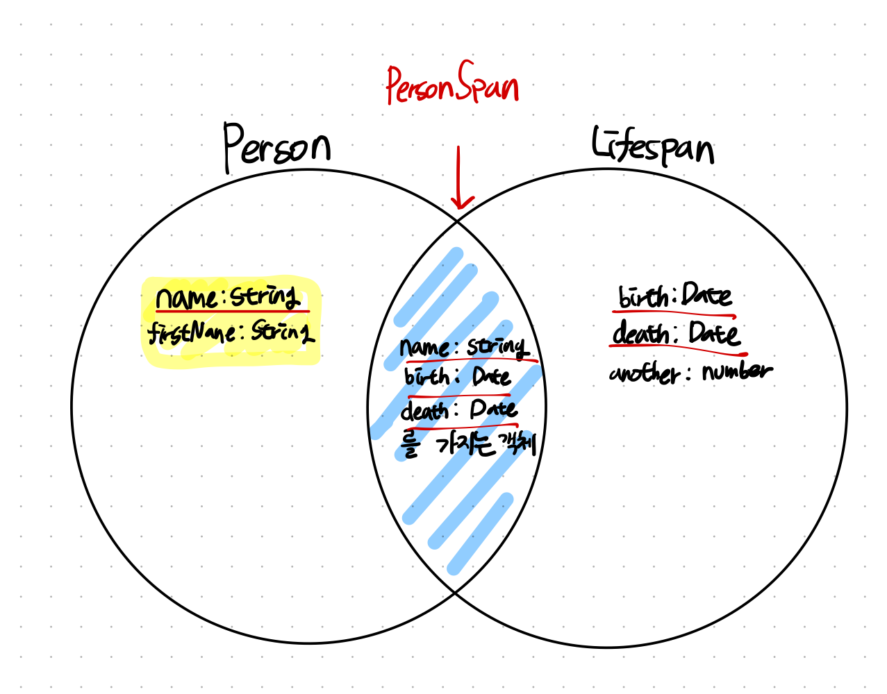

# 타입을 값들의 집합이라고 생각하기

런타임에 모든 변수는 JS 세상의 값으로 정해지는 각자 고유의 값을 가진다.

다음의 예시는 런타임에서 가지는 고유의 **값** 을 살펴볼 수 있다.

- 42
- 37.25
- `'Canada'`
- `'Yunseong'`

하지만 타입스크립트는 런타임 이전에 오류를 체크한다.

이 때 타입스크립트는 타입을 가지게 되는데, **할당 가능한 값들의 집합** 이라고 생각하면 좋다.

이 집합은 타입의 범위라고도 부르기도 한다.

위의 예시를 살펴보자.

`42`, `37.25`는 `number 범위에 속하는 값들` 이라고 칭할 수 있다.

마찬가지로 'Canada'와 'Yunseong'은 string 범위에 속하는 값이라고 칭할 수 있다.

## 집합의 관점에서 타입 살펴보기

### never type

never는 값을 포함할 수 없는 빈 타입을 의미한다.

따라서 never에는 어떠한 값도 대입할 수 없다.

```typescript
// 모두 다 에러
let a: never = undefined;
let b: never = null;
let c: never = 12;
// type is never
type NeverType = string & number; // 교차 타입 연산에 대해서는 추후 설명
```

집합의 관점에서는 공집합으로 볼 수 있다.

### 리터럴(literal) 타입

통상적인 리터럴 이라는 의미처럼, 한가지 값만 포함하는 타입이다.

```typescript
type A = 'A';
type B = 'B';
```

타입 A와 B로 선언된 변수에는 각각 'A' 값과 'B' 값만 올 수 있다.

### 할당 가능한~ (assignable)의 의미

타입스크립트 에러에서 많이 보이는 문구 중, 할당 가능한(assignable)이라는 문구가 있다.

```
Type ??? is not assignable to type ???.(2322)
```

집합의 관점에서 이 문구는 `~의 원소` 혹은 `~의 부분집합`으로 살펴볼 수 있다.

```typescript
type A = 'hello';
let aValue: A = 'hello';
let strValue: string = 'test';
aValue = strValue; // Type 'string' is not assignable to type '"hello"'.(2322)
strValue = 11; // Type 'number' is not assignable to type 'string'.(2322)
```

위 오류에서 할당가능한을 `~의 원소`로 변경해보자.

1. string은 "hello" 타입 집합의 원소가 아니다.
2. number는 'string'타입 집합의 윈소가 아니다.

아래 예시는 TS가 부분집합인지 검사하는 내용을 잘 보여준다.

```typescript
type A = 'A';
type B = 'B';
type C = 'C';

type AB = A | B;
type ABC = A | B | C;

const ab: AB = Math.random() < 0.5 ? 'A' : 'B';

let abc: ABC = ab; // can assignable. type AB is Subset of ABC
```

변수 `ab`가 가질수 있는 값의 집합은 `'A'`, `'B'` 인데, 변수 `abc` 가 가질 수 있는 값의 집합은 `'A'`, `'B'`, `'C'` 이므로 **ab는 abc의 부분집합**이다.

따라서 `abc`변수에 `ab`를 할당할수가 있다.

## 교차, 유니온 연산의 사실과 오해

교차, 유니온 연산자를 단순히 집합으로 생각한다면 필자처럼 오해할수도 있다.

### 교차 타입 연산자

```typescript
interface Person {
  name: string;
}

interface LifeSpan {
  birth: Date;
  death: Date;
}

type PersonSpan = Person & LifeSpan; // it seem to never type, but...
```

Person과 LifeSpan 타입은 겹치는 속성이 없으므로, never타입이 되지 않을까 생각하기 쉽다.

하지만 타입 연산자는 값의 집합(type의 범위)에 적용된다. 그럼 어떤 관점으로 볼수 있냐면..



PersonSpan은 name 속성과 birth, death를 모두 가지는 값이 교차 타입에 속하게 된다.

### 유니온 연산자

유니온 연산자는 모든 타입의 범위를 뜻한다.

위 그림을 참고해 `type T = Person | LifeSpan` 의 범위를 생각해보자.

그림 그대로 합집합이 모두 올수 있는 범위다. 예시는 T에 올수있는 값들의 부분집합들이다.

- `{ name:'hi', age: 11 }`
- `{ name:'hi', firstName: 'park' }`
- `{ name:'hi', birth:new Date(), death:new Date() }`
- `{ food:'hel', birth:new Date(), death:new Date() }`
- `{ birth:new Date(), death:new Date() }`

## extends 연산자와 부분집합의 관계

위의 교차 타입의 예시(PersonSpan)를 extends로 구현해보자.

아래 예시는 이전의 PersonSpan과 같다.

```typescript
interface Person {
  name: string;
}

interface PersonSpan extends Person {
  birth: Date;
  death: Date;
}
```

`extends`는 `"~의 부분집합"` 이라는 의미로 다가갈수 있다.

따라서 `interface PersonSpan extends Person` 은 **`PersonSpan`은 `Person`의 부분집합** 이라고 표현 가능하다.

자꾸 그림을 재사용하지만 위 예시 그림을 살펴보자.

`LifeSpan`을 빼고 `PersonSpan` 부분과 `Person`만 보면 명확하게 알 수 있을 것이다.

## 끝내며

이번 주차는 이펙티브 타입스크립트 아이템 7을 정리하며 공부했다.

책에 나오는 내용을 정리해보며 공부해보았는데, 처음읽을때보다 잘 정리되었던 것 같다.
