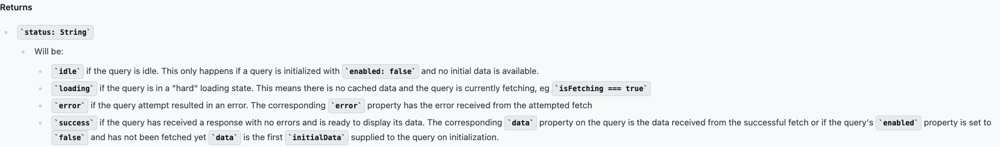

# 유효한 상태만 표현하는 타입을 지향하기

타입을 잘 설계하면 코드는 직관적으로 작성할 수 있습니다. 아주 마법 같은 말이지만, 그 만큼 타입을 잘 설계하는 것이 중요하다는 말입니다.

웹 애플리케이션을 만든다고 가정 해보겠습니다.

어떤 웹 페이지를 서버로 부터 불러오면, 여러가지 상태가 있습니다. (로딩 중, 에러, 등등..)

현재 애플리케이션의 상태를 다음과 같이 설계 해보았습니다.

```ts
interface State {
  pageText: string;
  isLoading: boolean;
  error?: string;
}
```

얼핏보면 괜찮다는 생각이 듭니다. 이제 페이지를 그리는 render함수를 구현해보겠습니다.

```ts
function renderPage(state: State) {
  if (state.error) {
    return `Error`;
  } else if (state.isLoading) {
    return `Loading...`;
  }
  return `<div>${state.pageText}</div>`;
}
```

이 코드도 문제는 없어 보입니다. 모든 상태에 대해 대응했다고 생각이 들기 때문입니다.

하지만 문제가 있습니다. `isLoading` 상태와 `error`상태가 함께 있다면, 그에 따른 분기가 어떻게 처리되어야 할지 파악할 수 없습니다.

이러한 이유는 동일한 상태가 두 가지 변수로 나타내져 있기 때문입니다. 따라서 충돌합니다.

**로딩 중, 에러, 렌더완료 등의 상태는 같이 관리해야 할 상태**로 볼 수 있습니다.

그러한 예로 react-query 라이브러리를 보면 동일하게 관리함을 알 수 있습니다.

